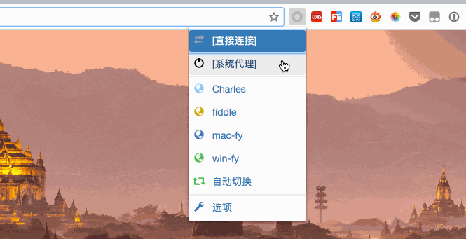
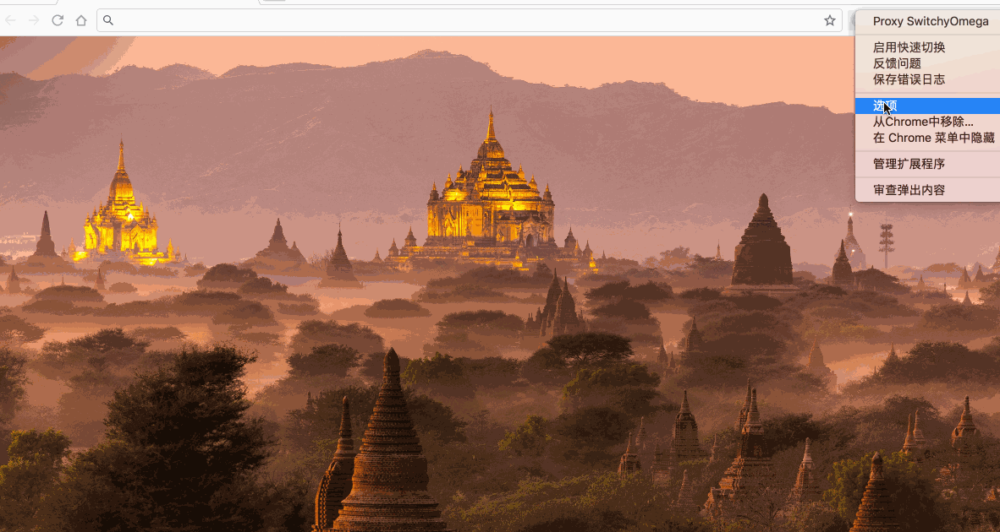
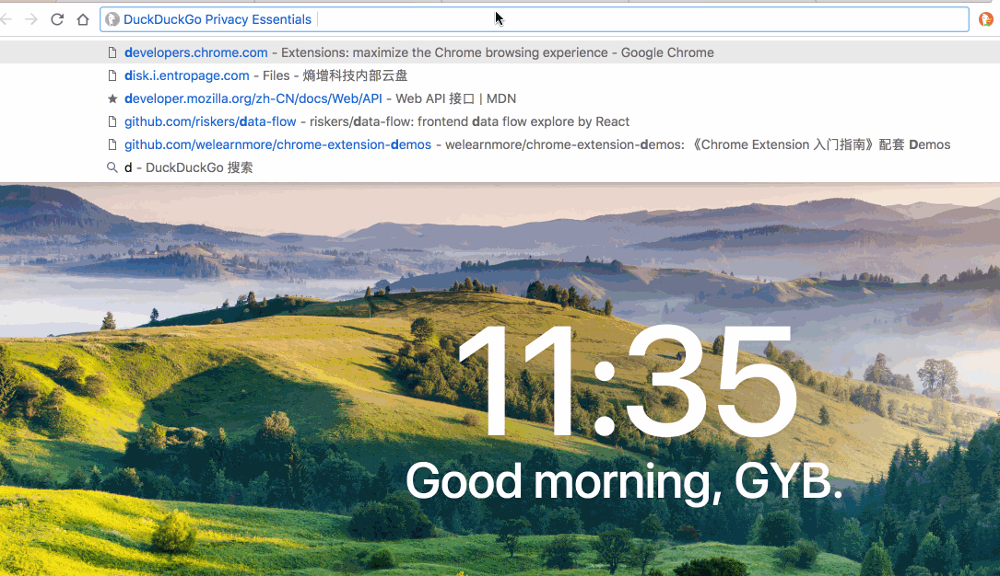
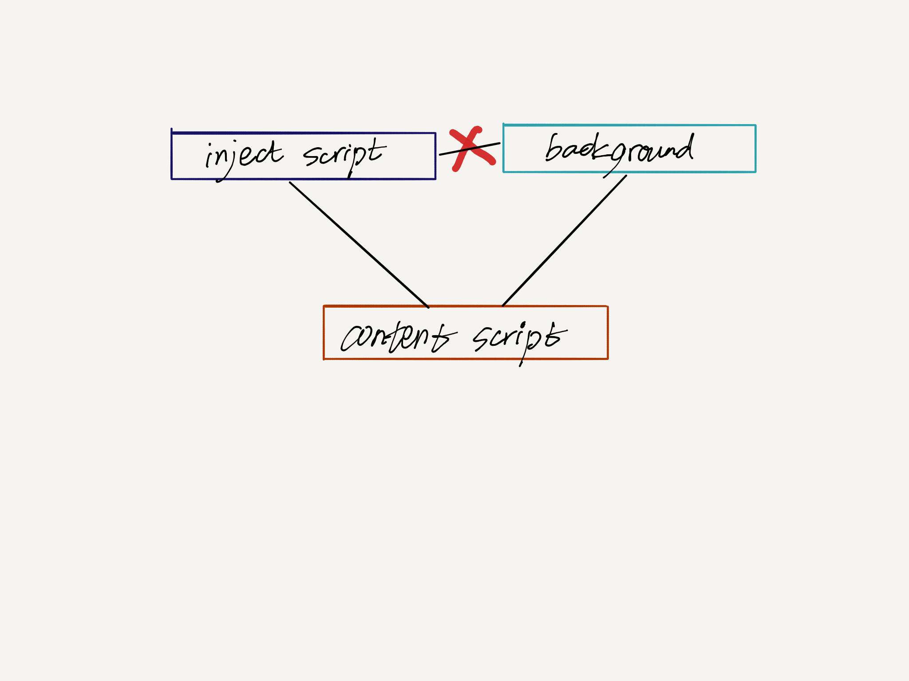

title: Chrome Extension
speaker: riskers
transition: move
prismTheme: dark
date: 2018年8月24日

<slide>
# Chrome Extension

[<i class="fa fa-home"></i>](https://github.com/riskers/blog)
[<i class="fa fa-github"></i>](https://github.com/riskers/)
[<i class="fa fa-weibo"></i>](http://weibo.com/damaoxianjia123)

[slide data-transition="zoomin"]
* Chrome Extension 能做什么 {:&.fadeIn}
* Chrome Extension 核心
  * background
  * content_scripts
  * inject_scripts
* Chrome 开发概述
  * [manifest.json](https://developer.chrome.com/extensions/manifest)
  * [Chrome Extension API](https://developer.chrome.com/extensions/api_index)
* Chrome Extension VS Chrome App
* Chrome 安全问题

****************************************************************************************************************

[slide data-transition="zoomin"]
# Chrome Extension 能做什么

* popup {:&.fadeIn}
* option
* omnibox
* contextMenus
* override

<slide>
# popup - 常用选项

<slide>
# options - 配置

<slide>
# omnibox - 搜索栏

<slide>
# contextMenus - 右键菜单

<slide>
# override - 自定义 Chrome 页面

* history: 浏览历史 {:&.fadeIn}
* newtab: 新 Tab
* bookmarks: 收藏夹

<slide>
# 其他

* [tabs](https://developer.chrome.com/extensions/tabs) {:&.fadeIn}
* [cookies](https://developer.chrome.com/extensions/cookies)
* [storage](https://developer.chrome.com/extensions/storage)
* [webRequest](https://developer.chrome.com/extensions/webRequest)

****************************************************************************************************************

[slide data-transition="zoomin"]
# Chrome Extension 核心

* background 主进程 {:&.fadeIn}
  * 生命周期: 常驻 Chrome 后台
* content_scripts 注入 CSS / JavaScript
  * 控制 DOM
* inject_scripts 注入 CSS / JavaScript?
  * 获取 `window` 变量

<slide>

# 三者通信

<slide>
* `background <-> content_scripts`: [chrome.runtime.onMessage](https://developer.chrome.com/apps/runtime#event-onMessage) / [chrome.runtime.sendMessage](https://developer.chrome.com/apps/runtime#method-sendMessage)
* `content_scripts <-> inject_scripts`: [window.postMessage](https://developer.mozilla.org/zh-CN/docs/Web/API/Window/postMessage) / [window.onMessage](https://developer.mozilla.org/zh-CN/docs/Web/API/WindowEventHandlers/onmessage)

<slide>
# 三者权限

| | Chrome API | DOM | window 变量 |
| -- | -- | -- | -- |
| background | All | None | None |
| content_scripts | not all | All | None |
| inject_scripts | None | All | All |

****************************************************************************************************************

[slide data-transition="zoomin"]
# Chrome Extension VS Chrome App

* 权限不同 (如 FileSystem)
* 展现形式不同

****************************************************************************************************************

[slide data-transition="zoomin"]
# Chrome Extension 安全问题

## 无审核，无监控，十分钟上线

<slide>
# Chrome 禁止使用非 web store 下载的扩展

* Windows Chrome 用户自己在 chrome://extension 安装 crx 的方法在 13 年就已经被[禁止](https://blog.chromium.org/2013/11/protecting-windows-users-from-malicious.html)

* Mac Chrome 用户安装 crx 的方法在 15 年也被[禁止](https://blog.chromium.org/2015/05/continuing-to-protect-chrome-users-from.html)

* [inline-install 被禁止](https://blog.chromium.org/2018/06/improving-extension-transparency-for.html)

<slide>

# [permissions_warning](https://developer.chrome.com/apps/permission_warnings#permissions_with_warnings)

<slide>

<slide>

# 查看源码

* Mac ~/Library/Application\ Support/Google/Chrome/Default/Extensions/{Extension-ID}

****************************************************************************************************************

[slide data-transition="zoomin"]
# THANKS

****************************************************************************************************************

[slide data-transition="zoomin"]
# Q & A

****************************************************************************************************************