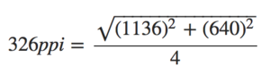
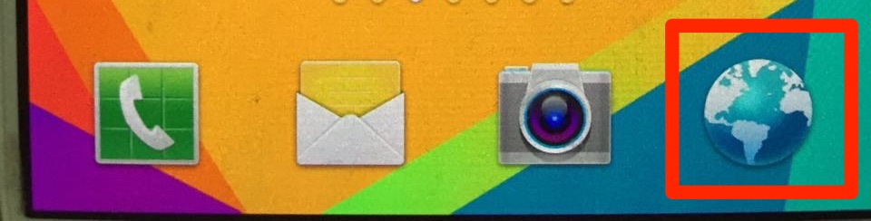
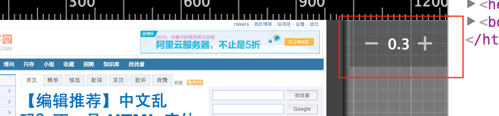
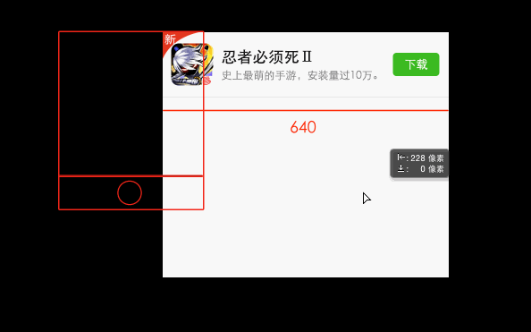
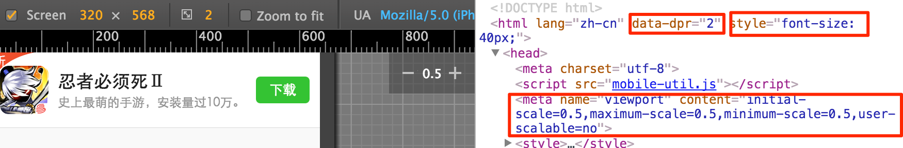
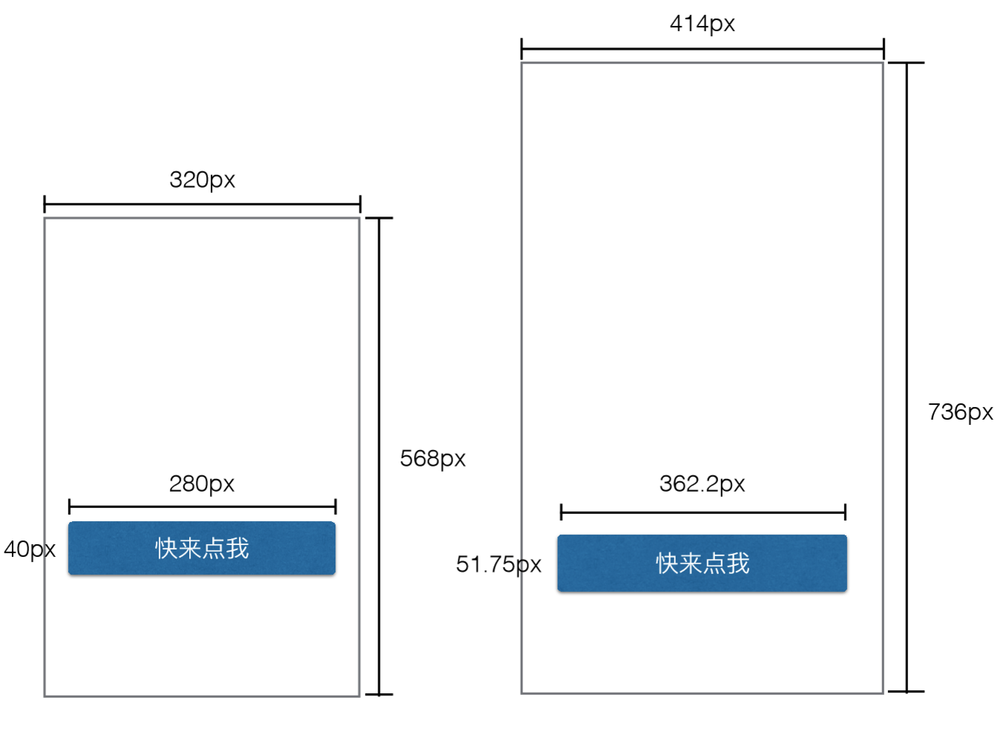

title: 移动端页面适配方案
speaker: riskers
theme: tomorrow
url: https://riskers.github.io/share/flexible


<slide :class="aligncenter">
# 移动端页面适配方案
---

[:fa-home:](https://github.com/riskers/blog)
[:fa-github:](https://github.com/riskers/)
[:fa-weibo:](http://weibo.com/damaoxianjia123)

<slide :class="aligncenter">
# 1. 像素

<slide>
`width:200px` 代表什么？`px`到底是多长？

* **设备像素** {:&.fadeIn}
    屏幕的物理像素，任何设备屏幕的物理像素的数量都是固定不变的，单位是`pt`

* **CSS 像素**
    * 在 CSS、JS 中使用的抽象单位，单位是`px`
    * CSS 像素也被称为**设备独立像素**(dips)，单位是`dp`


<slide>
## 设备像素与CSS像素的关系
---

* 取决于两个条件
    * 页面是否缩放 {:&.fadeIn}
    * 屏幕是否为高密度


<slide>
## 分辨率、屏幕尺寸和屏幕像素密度
---

以 iPhone5 为例

* **分辨率**： `1136pt x 640pt` {:&.fadeIn}
* **屏幕尺寸**： `4英寸`
* **屏幕像素密度**：`326dpi`
    * 屏幕像素密度（Pibel Per Inch）简称 `ppi` ，单位是 `dpi`（dot per inch）。这里指屏幕水平或垂直每英寸有 326 个物理像素。原则上来说，ppi 越高越好，因为图像会更加细腻清晰。

* 
* https://www.sven.de/dpi/

<slide :class="aligncenter">
## 2. 视口
---

* 桌面浏览器 {:&.fadeIn}
    * 浏览器窗口就是约束你的 CSS 布局视口（又称初始包含块），是所有 CSS 百分比宽度推算的根源 {:&.moveIn}
    * 它的作用是给**CSS 布局限制了一个最大宽度**，视口的宽度和浏览器窗口宽度一致
* 在移动端，情况就变得很复杂了
* 以下讨论的宽度单位都是 **CSS 像素** (除了`screen.width`)

<slide>
## 布局视口
---
* 一个没有为移动端做优化的网页，会尽可能缩小网页让用户看到所有东西 {:&.fadeIn}
* 浏览器厂商为了让用户在小屏幕下网页也能够显示地很好，所以把视口宽度设置地很大，一般在 768px ~ 1024px 之间，最常见的宽度是 980px
* 

<slide>
## 布局视口
----

* **设置布局视口的宽度** {:&.fadeIn}

    ```html
    <meta name="viewport" content="width=640">
    ```

* 获取布局视口尺寸

    `document.documentElement.clientWidth/Height`

<slide>
## 视觉视口
----

* 用户正在看到的网页的区域，大小是屏幕中**CSS 像素**的数量 {:&.fadeIn}

* 
* 获取视觉视口尺寸

    `window.innerWidth/Height`


<slide>
## 理想视口
----

* **对设备来说最理想的布局视口尺寸** {:&.fadeIn}
    * 布局视口忽略了手机本身的尺寸 {:&.moveIn}
    * 视觉视口对开发没什么用
    * 理想视口中的页面有最理想的宽度，用户进入页面不用缩放
* 使用理想视口
    * `<meta name="viewport" content="width=device-width">`
    * 其实就是把布局视口设置成屏幕宽度
    * 定义理想视口是浏览器的事情，并不能简单地认为是开发者定义的，开发者只能使用

<slide :class="aligncenter">
# 3. screen.width/height

<slide>

`screen.width/height` 返回理想视口的尺寸，有严重兼容性问题，可能返回两种值：

* 理想视口的尺寸（下载浏览器） {:&.moveIn}
* 屏幕的设备像素尺寸（内置浏览器）

* 测试 `screen.width`，同一设备的不同浏览器返回的值可能是不一样的：

    * [Screen size tests](http://quirksmode.org/m/tests/widthtest.html)
    * [Understanding viewport](http://andreasbovens.github.io/understanding-viewport/)

:::note
默认浏览器是安卓系统内置的浏览器，长下面那个样子。而且它使用的是Webkit而不是Blink。只有在更新安卓系统的时候才能更新它。直到安卓4.3，Google不再更新。




而下载浏览器都返回的是理想视口尺寸。
:::


<slide :class="aligncenter">
# 4. 缩放

<slide>
### 缩放与设备像素、CSS像素的关系
----

* 缩放是在放大或缩小**CSS 像素** {:&.fadeIn}

[note]
比如一个宽度为 200px 的元素无论放大，还是200个CSS像素。但是因为这些像素被放大了，所以CSS像素也就跨越了更多的设备像素。缩小则相反。
[/note]


<slide>
## 缩放与视口
----

* **缩放会影响视觉视口的尺寸** {:&.fadeIn}
    * 因为缩放了 CSS 像素 {:&.fadeIn}
* **用户缩放不会影响布局视口**
    * 注意，这是『用户缩放』，后面会说开发者设置缩放的情况 {:&.fadeIn}


<slide>
## 查看缩放比例
---



>这里的 0.3 是相对于**理想视口**的

<slide>
## 计算缩放比例
---

在下载浏览器中，可以这么算（理想视口与视觉视口的比）：

```shell
zoom level = screen.width / window.innerWidth
```

<slide>
## 禁止缩放
---

```html
<meta name="viewport" content="user-scalable=no">
```

<slide>
## 设置缩放
---

```html
<meta name="viewport" content="initial-scale=2">
```

使用`initial-scale`有一个副作用：同时也会将布局视口的尺寸设置为缩放后的尺寸。所以`initial-scale=1`与`width=device-width`的效果是一样的。


<slide :class="aligncenter">
# 5. 完美视口

<slide>
解决各种浏览器兼容问题的理想视口设置

```html
<meta name="viewport" content="width=device-width,initial-scale=1">
```

<slide :class="aligncenter">
# 6. 设备像素比

<slide>
## DPR
---

* `window.devicePixelRatio` {:&.moveIn}
* 与设备像素、CSS 像素的关系
    * `dpr = 设备像素 / CSS像素` {:&.fadeIn}
* 与视口的关系
    * `dpr = 屏幕横向设备像素 / 理想视口的宽` {:&.fadeIn}


<slide :class="aligncenter">
# 7. 适配方案

<slide>
## 什么是适配
---


做 PC 页面的时候，我们按照设计图的尺寸来就好。

做移动端页面的时候，设计师给了一份宽度为 640px 的设计图。那么，我们把这份设计图实现在各个手机上的过程就是『适配』。


<slide>
以这个为例


<slide>
## 适配方案一：固定高度，宽度自适应
---

```html
<!--这样设置之后，我们就可以不用管手机屏幕的尺寸进行开发了-->
<meta name="viewport" content="width=device-width,initial-scale=1">
```

* [demo](http://www.meow.re/demo/screen-adaptation-in-mobileweb/app-fixed-height.html) {:&.moveIn}
* 配合媒体查询，解决大多数需求
* [腾讯](http://xw.qq.com/index.htm) [京东](http://m.jd.com/) [百度](https://www.baidu.com/) [天猫](https://www.tmall.com/) [亚马逊](http://www.amazon.cn/)

<slide>
## 适配方案二：固定宽度，viewport缩放
----

```html
<!--640 是根据设计图定下的，0.5 是根据屏幕宽度动态生成的-->
<meta name="viewport" content="
    width=640,
    initial-scale=0.5,maximum-scale=0.5,minimum-scale=0.5,
    user-scalable=no">
```

* [demo](http://www.meow.re/demo/screen-adaptation-in-mobileweb/app-fixed-width.html) {:&.moveIn}
* [荔枝FM](http://m.lizhi.fm/) [网易新闻](http://c.3g.163.com/CreditMarket/default.html)

<slide>
## 适配方案二：固定宽度，viewport缩放
---

**设计图、页面宽度、viewport width使用一个宽度，浏览器帮我们完成缩放。单位使用px即可**



[note]
生成的viewport告诉浏览器网页的布局视口使用 640px，然后把页面缩放成50%，这是绝对的等比例缩放。图片、文字等等所有元素都被缩放在手机屏幕中。
[/note]

<slide>
## 适配方案三：rem做宽度，viewport缩放
---

* [demo](http://www.meow.re/demo/screen-adaptation-in-mobileweb/app-rem.html) {:&.moveIn}
* [淘宝](https://m.taobao.com) [使用 Flexible 实现手淘 H5 页面的终端适配](https://github.com/amfe/article/issues/17)

<slide>
## 适配方案三：rem做宽度，viewport缩放
---



动态生成：

1. 屏幕宽度设置 `rem`的大小，即给`<html>`设置`font-size`
2. viewport init-scale
3. 根据设备像素比（window.devicePixelRatio）给`<html>`设置`data-dpr`

**可以让不同设备的`rem`或`px`都显示一样的长度**

<slide>
## 适配方案三：rem做宽度，viewport缩放
---

### 设置 rem
**得到一个与屏幕宽度相关的单位**



```css
html{
    font-size: 屏幕宽度 / 10;
}
.btn{
    width:8.75rem;
    height:1.25rem;
}
```


:::note
这个长度是相对于设备本身的，不同设备的`rem`显示一样的长度（CSS像素）
:::

<slide>
## 适配方案三：rem做宽度，viewport缩放
### 设置 viewport 缩放 和 data-dpr
**适配高密度屏幕手机的`px`单位**

```css
.a{
  font-size:12px;
}
[data-dpr="2"] .a{
  font-size: 24px;
}
[data-dpr="3"] .a{
  font-size: 36px;
}
```

:::note
设备像素比是2，缩放为0.5，`data-dpr`为 2

某元素字体大小应该为 12px，因为`[data-dpr=2]`，变成 24px，但又因为页面缩放 50%，所以还是 12px

**不同设备下的`px`显示一样的长度**
:::

<slide :class="aligncenter">
# 8. 总结

<slide>


第一种方案做简单页面还行，做复杂一点的就有点麻烦了。

<slide>


[note]
这是我曾经做过的一个页面，『PK』要和左右两张图平行，而且下面的『不怒自威』、『义薄云天』和下面的战斗力位置都要固定，不能有差。如果用第一种方案，可能各个元素就要绝对定位，然后各种百分比来定位了。且不说计算麻烦，而且辛苦一番最后的结果尺寸是和设计图有出入的。
[/note]

<slide>
## 第二种方案和第三种方案区别
----

目前我唯一知道的区别就是第三种方案更加灵活，有两种单位可以使用，想让元素适配的时候就用`rem`，想让文字不缩放的时候就用`px`

<slide>
# 参考资料

* [ppk 的移动端系列文章](http://quirksmode.org/mobile/)
* [screen.width is useless](http://www.quirksmode.org/blog/archives/2013/11/screenwidth_is.html)
* [devicePixelRatio](http://www.quirksmode.org/blog/archives/2012/06/devicepixelrati.html)
* [More about devicePixelRatio](http://www.quirksmode.org/blog/archives/2012/07/more_about_devi.html)

* [移动端高清、多屏适配方案](http://div.io/topic/1092)
* [从网易与淘宝的 font-size 思考前端设计稿与工作流](http://www.cnblogs.com/lyzg/p/4877277.html)
* [百度方案](http://js8.in/2015/12/12/%E6%89%8B%E6%9C%BA%E7%99%BE%E5%BA%A6%E7%A7%BB%E5%8A%A8%E9%80%82%E9%85%8D%E5%88%87%E5%9B%BE%E8%A7%A3%E5%86%B3%E6%96%B9%E6%A1%88%E4%BB%8B%E7%BB%8D/)
* [移动端自适应方案](http://f2e.souche.com/blog/yi-dong-duan-zi-gua-ying-fang-an/) 介绍了 flex 布局和rem方案

<slide>
# 原文

* [移动端适配方案(上)](https://github.com/riskers/blog/issues/17)
* [移动端适配方案(下)](https://github.com/riskers/blog/issues/18)

<slide>
# END

<slide>
# 切图神器
----

* [MarkMan](http://www.getmarkman.com/) / [PxCook](http://www.fancynode.com.cn/pxcook/home)
* [AssistorPS](http://www.uisdc.com/tag/assistor-ps) / [parker](http://www.cutterman.cn/v2/parker)
* [cutterman](http://www.cutterman.cn/v2/cutterman)
* [browsersync](http://www.browsersync.cn/)
