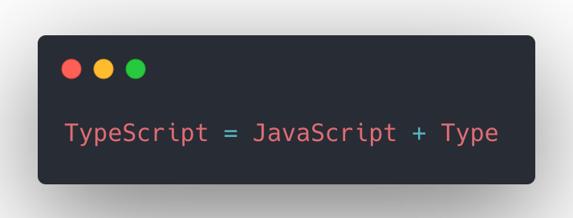

title: TypeScript 类型系统
speaker: riskers
url: https://riskers.github.io/share/typescript
js:

- https://www.googletagmanager.com/gtag/js?id=UA-131910384-4
- ./gtag.js

<slide class="aligncenter bg-apple" :class="size-60 frame" image="https://github-riskers-blog.oss-cn-qingdao.aliyuncs.com/20191030123829.png .anmi .dark">

# TypeScript 类型系统

30 min{.alignright}

<slide class="aligncenter bg-apple">

## JavaScript that scales

----

----

TypeScript 的关键在 Type (类型) 上 {.tobuild.moveIn}

-----

<slide class="bg-black-blue">

:::column {.bg-black-blue.vertical-align.sm}

!

---

* 强类型和弱类型
  1. 强类型\: 偏向于不容忍隐式类型转换
  2. 弱类型\: 偏向于容忍隐式类型转换
* 动态类型和静态类型
  1. 动态类型\: 编译的时候就知道每一个变量的类型
  2. 静态类型\: 编译的时候不知道每一个变量的类型，因为类型错误而不能做的事情是运行时错误

TypeScript 是强类型语言 也是静态类型语言
[:fa-code: code](https://stackblitz.com/edit/typescript-q5a6ag){.button.ghost.radius}
:::

:::note
使之强制数据类型定义的语言，没有强制类型转化前，不允许两种不同类型的变量相互操作
数据类型可以被忽略的语言

TS 在第一象限
:::

<slide class="bg-apple fullscreen">

:::card-60{.bg-black-blue}

------

## 基础类型

----

- Number
- Boolean
- String
- Array
- Tuple
- Enum
- Void
- Class

-----

[:fa-code: code](https://stackblitz.com/edit/typescript-tt5kim){.button.ghost.radius}
:::

:::note
类型声明: `{值}\: 类型`
:::

<slide class="bg-apple fullscreen">

:::card-50 {.bg-black-blue}

----

## 类型操作符

----

* `&`
* `|`
* `keyof`

----

[:fa-code: code](https://stackblitz.com/edit/typescript-kxlkfh?embed=1&file=index.ts){.button.ghost.radius}

:::

<slide class="bg-apple aligncenter">

## 工具类型
-----

* Partial
* Pick
* Readonly
* Mutable
* Record
* Extract
* Omit
* ...

<slide class="fullscreen">

:::card-50{.bg-black-blue}

----

### Partial

----

将一个 Interface 所有属性变为可选的

[:fa-code: code](https://stackblitz.com/edit/typescript-gfgizj?embed=1&file=index.ts){.button.ghost.radius}

:::

<slide class="bg-apple fullscreen">

:::card {.bg-black-blue}

----

## 泛型
------

[:fa-code: code](https://stackblitz.com/edit/typescript-qvmhev?embed=1&file=index.ts){.button.ghost.radius}
:::

<slide class="bg-apple aligncenter">

## interface / type
----

:::column

* 都可以描述一个对象或者函数
* 都允许 extends

-----

* type 可以声明基本类型别名，联合类型，元组等类型
* type 语句中还可以使用 typeof 获取实例的 类型进行赋值

-----

* interface 能够声明合并
:::

<slide class="bg-apple">

## namespace & module
----

`namespace` 和 `module` 都是过时的产物，很少有项目使用了，现在统一使用 ES6 模块

----

怎么组织业务代码中 interface / type ?
- 模块外有人用就 export 出去 `export interface IFoo {}`

<slide class="bg-apple">

## 编写 .d.ts 声明文件
-----

- declare namepsace
- declare module

<!-- > https://ts.xcatliu.com/basics/declaration-files#fa-bu-sheng-ming-wen-jian -->

----

[:fa-code: code](https://stackblitz.com/edit/typescript-cxc1vo) {.button.ghost.radius}

<slide class="bg-apple">

## 使用 TypeScript 的好处
----

- 生态强大
  - 各个开源项目要么是直接用 TS 开发的
  - 虽然是 JS 写的，但提供了 @types .d.ts 文件
- 代码提示
- 不用看文档
- 将低级错误暴露在编译期

<slide class="bg-apple aligncenter">

### 基本就是静态类型语言对动态类型语言的好处
-----

> 动态类型一时爽,
>
> 代码重构火葬场!

<slide class="bg-apple">

## 开始使用

----

> 如果你对 ES6+ 很熟，那么你已经会了 TS 80%，剩下的 20% 是熟悉 TS 独特的类型系统
>
> TS 的哲学\: 在某些功能是它独创，比如它的 `class` 和 `namespace` / `module` ，但是在 ECMAScript 2015 发布之后向 JS 靠拢，JS 没有进 stage4 的功能它不会实现(optional chaining)，JS 已经实现的它也实现的被废弃(namespace / module 现在只在声明类型的时候用)

<slide class="bg-apple">

## JavaScript 标准
---

- [tc39](https://github.com/tc39)
- [babel](https://babeljs.io/)
- [TypeScript](https://www.typescriptlang.org/)

:::note
什么是标准？ W3C / tc39

什么是宿主？ Chrome / Node / ...

babel 为什么存在? 前端编译器

TS 为什么存在? 静态类型
:::

<slide class="bg-apple">

## IDE 中使用 TS
----

* VSCode\: https://gist.github.com/riskers/0bb7b9fcea5747c21d1d195566c29fbf
* WebStorm\: 默认支持

<slide class="bg-apple">

## 什么时候适合使用 TypeScript
-----

- 大型项目
- 多人协作
- 长期迭代维护
- 活动页什么的就没必要了，太折腾

<slide class="bg-apple">

## JavaScript -> TypeScript
----

* 可以逐个文件迁移
* 没有 type 的 JS 模块使用 `declare` 粗暴解决

<slide class="bg-apple">

# 实例
----

[:fa-code: code](https://stackblitz.com/edit/typescript-fu7mf7) {.button.ghost.radius}

<slide class="bg-apple">

# Thanks
